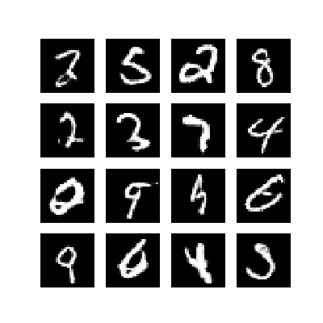

# GAN-Practice
Creating some GANs

## MNIST 
A simple first project: training a generative adversarial network (GAN) using Keras+TensorFlow to generate MNIST digits (see below for some sample generated digits).

## Audio
A (somewhat dead-end) idea to create an end-to-end GAN that can generate short music clips.
First created an audio auto-encoder, with some success, but could not progress further due to hardware limitations.
